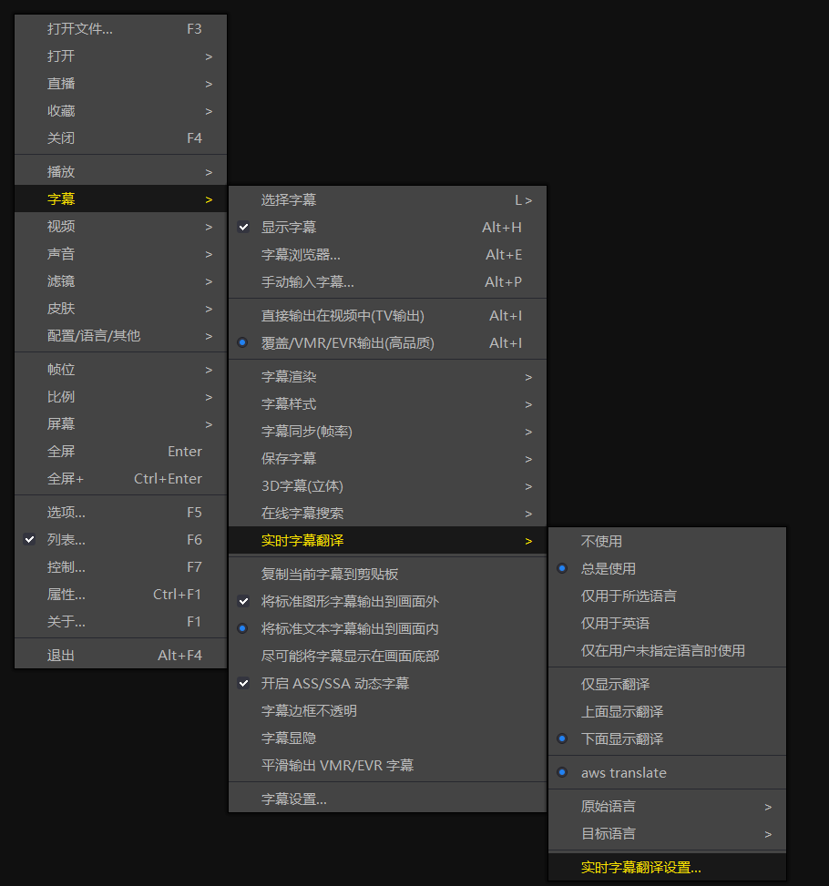
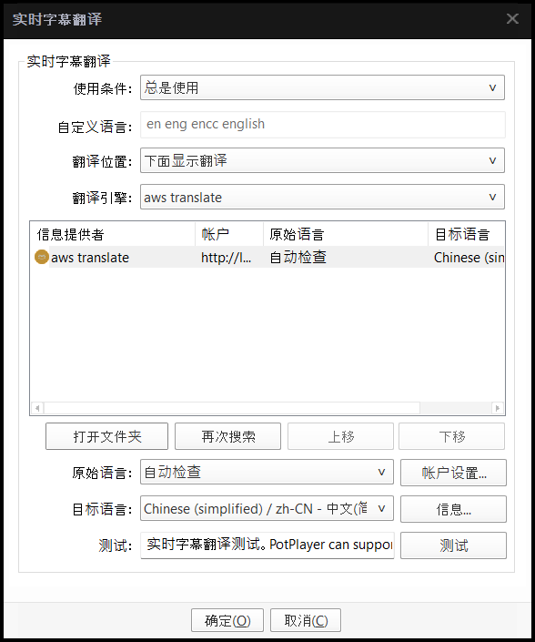
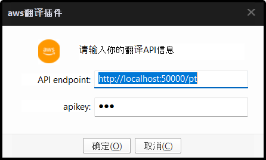
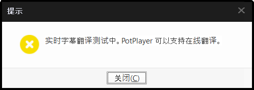
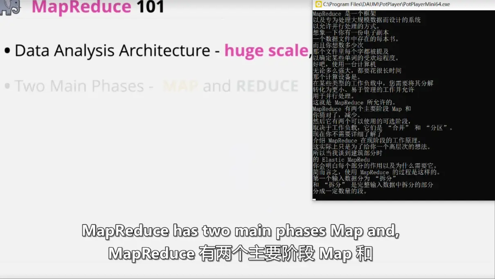
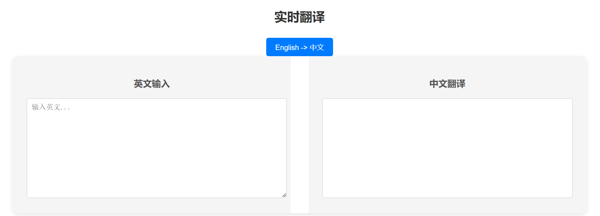

## 使用指南

声明：本程序不提供任何aws的凭证，也不会采集任何凭证，源码均已开放

### 安装说明

1. 安装potplayer，官网是https://potplayer.daum.net/, 然后打开实时翻译设置



2. 下载项目脚本，git clone git@github.com:Xu-Hardy/potplayer_translate_plug_in.git
3. 安装播放器脚本，把Extension目录下的`1SubtitleTranslate - aws.as`和`SubtitleTranslate - aws.ico`放到`C:\Program Files\DAUM\PotPlayer\Extension\Subtitle\Translate`这个目录，如果你的默认路径不是这个，那么按照如图所示。这里打开文件夹可以看到你的potplayer插件目录，然后点击账户设置。




4. 安装Python和依赖，这里推荐[miniconda](https://docs.conda.io/projects/miniconda/en/latest/index.html)和[pip清华源](https://mirrors.tuna.tsinghua.edu.cn/help/pypi/) 

```bash
pip config set global.index-url https://pypi.tuna.tsinghua.edu.cn/simple
```

5. 把AWS 海外区的ak/sk写到.env中，格式参考temp.env，需要部署的域名替换translate-app\front-end\src\config\config.js中的http://localhost:50000/translate


6. 接下来是配置endpoint和apikey, 填写刚刚部署的地址，比如http://yourip:50000/pt，apiley随意。




配置好之后，就可以查看翻译字幕效果了，同时这里对输出的字幕做出了汇总。



出现以上界面表明可以正常翻译。



同时也提供了一个翻译的UI界面，足以替代bing, google和deepl的翻译：

