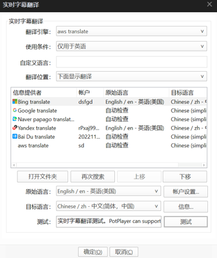
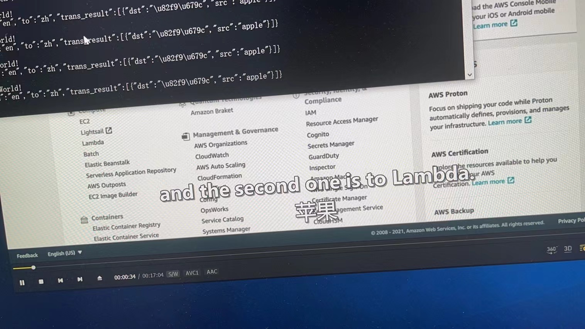
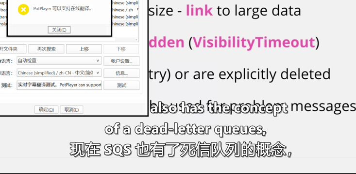

# 关于potplayer

这个插件使用的是AngelScript, 这个语言很小众。基本也就只有官方文档可以参考。

http://200t.w3cschool.cn/angelscript/

http://www.angelcode.com/angelscript/documentation.html

目前猜测是调用了视频播放器自带的钩子函数。

看到了有人制作了关于百度api翻译实时字幕的教程，然后去github翻了下作者的源代码，以此为灵感，写了一个基于aws的翻译插件，并且用flask 实现一个api的封装，api内部调用了aws的翻译服务。

翻译效果图

